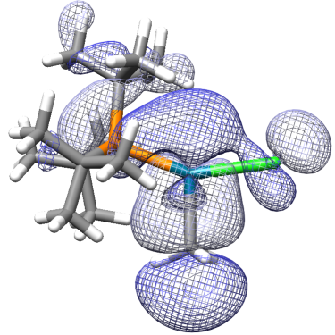

<h1 align="center">pd-c-photochem-ML ⚛️📊</h1>

  
  

> An exploration of how phosphine ligand properties affect Pd-C photocleavage in T-shaped methylpalladium complexes.

### 🏠 [Homepage](https://github.com/pmwaddell/ligands-ML)

## Setup (WORK IN PROGRESS!)

Please see the publication I coauthored ([10.1039/D3SC02588H](https://doi.org/10.1039/D3SC02588H), thanks to the RSC 
for making it open access) describing visible light-induced homolytic Pd-C bond cleavage in phosphine-ligated, T-shaped 
organopalladium complexes. This repo represents a computational exploration of the generality of this reactivity, and 
how phosphine ligand properties can impact the photophysical and photochemical characteristics of these complexes.

The exploration of phosphine chemical space in this project was facilitated by the 
[Kraken virtual library](https://descriptor-libraries.molssi.org/kraken/).

Things that are needed:

* rdkit etc.
* pandas will be used I'm sure
* ORCA (make sure you check the parallel option), with the absolute path indicated in config.yaml.
* Microsoft MPI

## Author

👤 **Peter Waddell**

* Website: https://github.com/pmwaddell
* Github: [@pmwaddell](https://github.com/pmwaddell)
* LinkedIn: [@https:\/\/www.linkedin.com\/in\/peter-waddell-ph-d-00b95265\/](https://linkedin.com/in/https:\/\/www.linkedin.com\/in\/peter-waddell-ph-d-00b95265\/)

## Show your support

Give a ⭐️ if this project helped you!

## 📝 License

Copyright © 2024 [Peter Waddell](https://github.com/pmwaddell). 
This project is [MIT](https://www.mit.edu/~amini/LICENSE.md) licensed.
